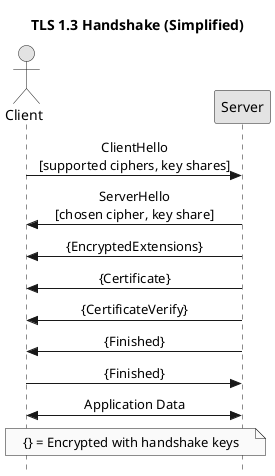
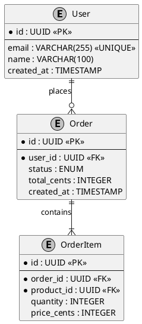
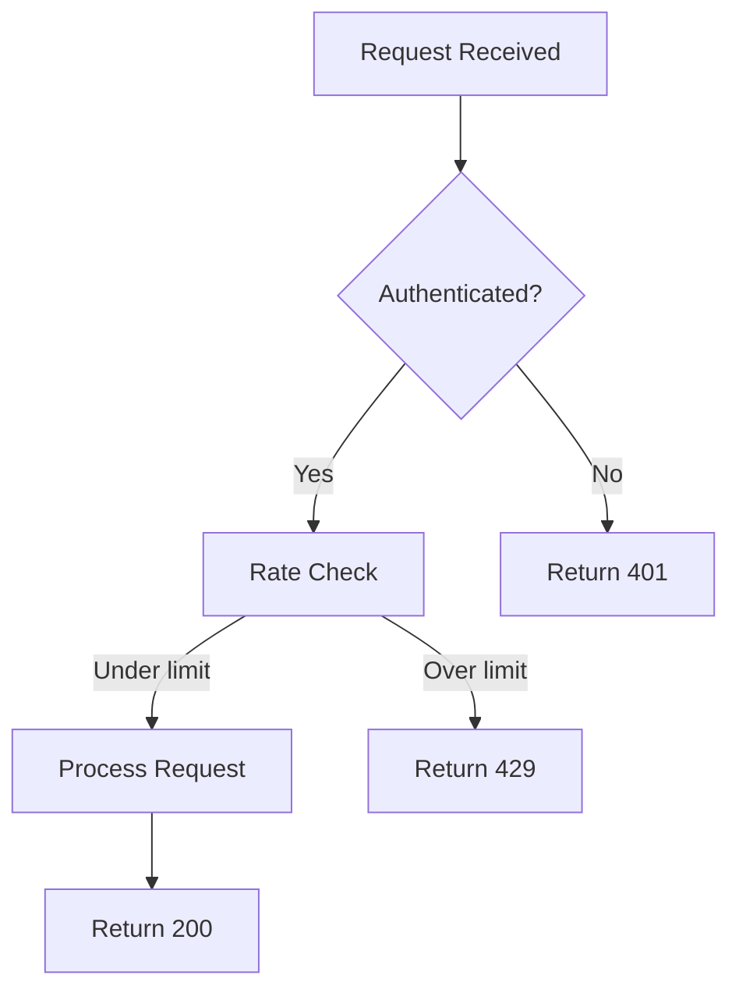
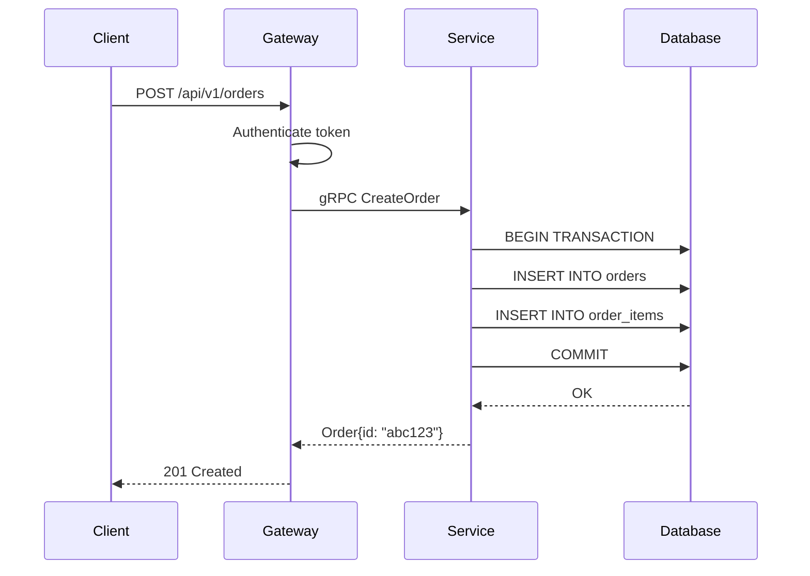
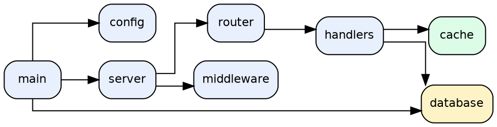

# DIAGRAMS.md — Diagram Standards

## Purpose

This file defines the standards for every type of diagram produced in documentation
projects: which tool to use for each diagram type, how to ensure vector quality,
how to caption and label diagrams, and how to integrate them into the document.

All diagrams must be vector-format unless the source is inherently rasterized (such
as a screenshot). Vector diagrams scale without pixelation and print crisply at
any resolution.

## Tool Selection Guide

Select the tool based on what you are diagramming:

| Diagram Type | Primary Tool | Alternative | Format |
|---|---|---|---|
| Architecture / system | TikZ | Mermaid, Draw.io | PDF/SVG |
| Flowchart / algorithm | TikZ | Mermaid | PDF/SVG |
| Sequence diagram | PlantUML | Mermaid | SVG |
| ER diagram | PlantUML | Graphviz | SVG |
| State machine | TikZ | PlantUML | PDF/SVG |
| Class diagram | PlantUML | Mermaid | SVG |
| Data flow diagram | Graphviz | TikZ | SVG |
| Dependency graph | Graphviz | Mermaid | SVG |
| Network topology | TikZ | Draw.io | PDF/SVG |
| Performance chart | PGFPlots | gnuplot | PDF |
| Timeline / roadmap | TikZ | Mermaid | PDF/SVG |
| Mind map | TikZ (mindmap lib) | Excalidraw | PDF/SVG |
| Call graph | Graphviz | — | SVG |
| Component diagram | TikZ | PlantUML | PDF/SVG |
| Decision tree | TikZ | Graphviz | PDF/SVG |

**Preference hierarchy for LaTeX documents**: TikZ > PlantUML SVG > Graphviz SVG > Mermaid SVG

TikZ produces native PDF output that integrates seamlessly with LaTeX. External SVGs
require conversion to PDF with `inkscape --export-pdf` before inclusion.

## TikZ Diagrams

TikZ diagrams are written inline in the LaTeX source or in separate `.tex` files in
`figures/chNN/`. Use separate files for complex diagrams to keep chapter files readable.

### Architecture Diagram Template (TikZ)

```latex
%% figures/ch02/system-architecture.tex
\begin{tikzpicture}[
  node distance = 1.5cm and 2cm,
  every node/.style = {
    draw,
    rounded corners,
    minimum width = 2.5cm,
    minimum height = 0.8cm,
    font = \small\sffamily,
    align = center,
  },
  component/.style = {
    fill = blue!10,
    draw = blue!50!black,
  },
  database/.style = {
    cylinder,
    shape border rotate = 90,
    aspect = 0.3,
    fill = green!10,
    draw = green!50!black,
  },
  external/.style = {
    fill = gray!10,
    draw = gray!50!black,
    dashed,
  },
  arrow/.style = {
    -Stealth,
    thick,
    draw = gray!70!black,
  },
]

% Nodes
\node[component] (client)  {Client};
\node[component, right=of client] (api) {API\\Gateway};
\node[component, right=of api] (service) {Business\\Logic};
\node[database, right=of service] (db) {PostgreSQL};
\node[external, below=of api] (auth) {Auth Service\\(External)};

% Arrows
\draw[arrow] (client)  -- node[above,font=\tiny] {HTTP/2} (api);
\draw[arrow] (api)     -- node[above,font=\tiny] {gRPC}   (service);
\draw[arrow] (service) -- node[above,font=\tiny] {SQL}    (db);
\draw[arrow] (api)     -- node[right,font=\tiny] {OAuth}  (auth);

\end{tikzpicture}
```

Include in chapter:
```latex
\begin{figure}[H]
  \centering
  \input{figures/ch02/system-architecture}
  \caption{High-level system architecture showing the request path from client
           to database through the API gateway.}
  \label{fig:system-architecture}
\end{figure}
```

### Flowchart Template (TikZ)

```latex
%% figures/ch03/request-lifecycle.tex
\begin{tikzpicture}[
  node distance = 1.2cm,
  startstop/.style = {
    rectangle, rounded corners, minimum width=3cm, minimum height=0.7cm,
    text centered, draw=black, fill=gray!20, font=\small\sffamily,
  },
  process/.style = {
    rectangle, minimum width=3cm, minimum height=0.7cm,
    text centered, draw=black, fill=blue!15, font=\small\sffamily,
  },
  decision/.style = {
    diamond, minimum width=2.5cm, minimum height=0.7cm,
    text centered, draw=black, fill=orange!20, font=\small\sffamily,
    aspect=2,
  },
  arrow/.style = { -Stealth, thick },
]

\node[startstop] (start) {Request received};
\node[process, below=of start] (auth) {Authenticate};
\node[decision, below=of auth] (valid) {Valid?};
\node[process, below=of valid] (process) {Process request};
\node[startstop, below=of process] (respond) {Return response};
\node[process, right=3cm of valid] (reject) {Return 401};

\draw[arrow] (start)   -- (auth);
\draw[arrow] (auth)    -- (valid);
\draw[arrow] (valid)   -- node[left]  {\small yes} (process);
\draw[arrow] (valid)   -- node[above] {\small no}  (reject);
\draw[arrow] (process) -- (respond);

\end{tikzpicture}
```

### State Diagram Template (TikZ)

```latex
\begin{tikzpicture}[
  -Stealth,
  node distance = 3cm,
  state/.style = {
    circle, draw=blue!60, fill=blue!10, minimum size=1.2cm,
    font=\small\sffamily, align=center,
  },
  initial state/.style = {
    state, draw=black, fill=gray!20,
  },
  accepting/.style = {
    state, double, draw=green!60!black,
  },
]

\node[initial state] (idle)    {IDLE};
\node[state, right=of idle]    (connecting) {CONNECT-\\ING};
\node[state, right=of connecting] (connected) {CONNECTED};
\node[accepting, below=of connected] (closed) {CLOSED};

\draw (idle)        edge[bend left=10] node[above]{\small connect()} (connecting);
\draw (connecting)  edge[bend left=10] node[above]{\small ACK}       (connected);
\draw (connecting)  edge[bend right=30] node[below]{\small timeout}  (idle);
\draw (connected)   edge node[right]{\small close()}                 (closed);
\draw (connected)   edge[loop above]   node{\small send/recv()}      (connected);

\end{tikzpicture}
```

### PGFPlots: Performance Charts

```latex
%% Benchmark results chart
\begin{figure}[H]
  \centering
  \begin{tikzpicture}
  \begin{axis}[
    ybar,
    bar width=0.6cm,
    ylabel={Throughput (req/s)},
    xlabel={Concurrency level},
    xtick={1,2,3,4},
    xticklabels={1,4,16,64},
    ymin=0,
    enlarge x limits=0.2,
    legend style={at={(0.5,-0.15)}, anchor=north, legend columns=-1},
    nodes near coords,
    nodes near coords align={vertical},
    font=\small,
  ]
  \addplot coordinates {(1,1200) (2,4800) (3,18500) (4,52000)};
  \addplot coordinates {(1,1100) (2,4200) (3,16000) (4,41000)};
  \legend{System A, System B}
  \end{axis}
  \end{tikzpicture}
  \caption{Throughput comparison at varying concurrency levels (higher is better).
           Hardware: [specify]. Version: [specify]. Methodology: [link].}
  \label{fig:throughput-comparison}
\end{figure}
```

## PlantUML Diagrams

PlantUML generates SVG or PNG from a text DSL. Use for: sequence diagrams, class
diagrams, ER diagrams, activity diagrams.

Always generate SVG output and convert to PDF for LaTeX inclusion:
```bash
plantuml -tsvg diagram.puml
inkscape --export-pdf=diagram.pdf diagram.svg
```

### Sequence Diagram (PlantUML)



### ER Diagram (PlantUML)



## Mermaid Diagrams

Mermaid is appropriate for:
- Markdown-first documentation (GitHub, MkDocs, Docusaurus)
- Quick architecture sketches that will be replaced with TikZ
- GitBook or mdBook deployments where Mermaid renders natively

Do not use Mermaid for PDF-targeted LaTeX output. Convert to SVG first:
```bash
mmdc -i diagram.mmd -o diagram.svg -t neutral
inkscape --export-pdf=diagram.pdf diagram.svg
```

### Flowchart (Mermaid)


### Sequence Diagram (Mermaid)


## Graphviz Diagrams

Graphviz is best for automatically laid-out graphs: dependency graphs, call graphs,
ASTs, finite automata.



Render:
```bash
dot -Tsvg dependency-graph.dot -o dependency-graph.svg
dot -Tpdf dependency-graph.dot -o dependency-graph.pdf
```

## Diagram Quality Standards

Every diagram must satisfy:

1. **Vector format**: PDF (from TikZ/Graphviz) or SVG converted to PDF. Never PNG
   or JPEG for diagrams that contain text or geometric shapes.

2. **Consistent font**: Use the same font family as the document body. In LaTeX,
   TikZ inherits the document font automatically. For external tools, specify
   the font explicitly (as shown in PlantUML skinparam above).

3. **Consistent colors**: Use only the colors defined in `preamble.sty`. Do not
   introduce new colors per diagram.

4. **Labelled reference**: Every diagram in the main text has a `\label{}` and is
   referenced with `\autoref{}` before or immediately after the figure.

5. **Caption completeness**: See FIGURES.md for caption requirements.

6. **Minimum size**: No element in any diagram may be smaller than 8pt when rendered
   at the intended print size. Test by printing a page at 100% scale.

7. **Colorblind accessibility**: Every diagram must be interpretable in grayscale.
   Do not rely on red/green distinction alone. Use patterns or labels in addition
   to color.

8. **Whitespace**: Diagrams must have adequate padding. No content should touch the
   bounding box edge. Minimum 5mm padding on all sides.

## Naming Conventions

```
figures/
  ch01/
    fig01-system-overview.tex       (TikZ inline diagram)
    fig02-request-lifecycle.tex
    fig03-class-hierarchy.puml      (PlantUML source)
    fig03-class-hierarchy.svg       (generated)
    fig03-class-hierarchy.pdf       (converted for LaTeX)
```

Label format in LaTeX: `\label{fig:ch01-system-overview}`
Always include the chapter prefix to guarantee uniqueness.

## Inter-file Relationships

```
DIAGRAMS.md
    ├── LATEX.md        (TikZ package configuration in preamble.sty)
    ├── FIGURES.md      (caption and placement rules apply to all diagrams)
    ├── BUILD.md        (diagram rendering steps in the build pipeline)
    └── QUALITY.md      (diagram quality checklist)
```

---

## Diagram Tool Strengths and Limitations

This section extends the Tool Selection Guide with detailed strengths, limitations,
and ideal use cases for every supported tool.

### TikZ

**Strengths**:
- Native LaTeX integration — no external dependencies for PDF output
- Pixel-perfect control over every element
- Inherits document font automatically
- Produces PDF natively (no conversion step)
- Supports complex math and LaTeX notation inside diagrams
- Programmable (loops, conditions, calculations)
- Extensive library ecosystem (arrows, mindmap, positioning, shapes.geometric)

**Limitations**:
- Steep learning curve
- Complex diagrams require significant code
- Not suitable for quick iteration or exploration
- No interactive editing (text-only source)

**Ideal for**: Architecture diagrams, mathematical illustrations, state machines,
flowcharts in LaTeX documents, any diagram requiring LaTeX math notation.

### PlantUML

**Strengths**:
- Designed specifically for software diagrams
- Declarative syntax — express intent, not layout
- Handles complex sequence and class diagrams automatically
- Sequence diagrams are its strongest output
- Active development, extensive diagram type support

**Limitations**:
- Layout is automatic, not controllable — can produce poor layouts for complex graphs
- Not suitable for free-form architecture diagrams
- Java dependency for rendering
- SVG output quality varies by diagram type

**Ideal for**: Sequence diagrams, UML class diagrams, component diagrams, activity
diagrams, ER diagrams, deployment diagrams.

### Graphviz (dot)

**Strengths**:
- Best automatic layout for graphs (especially DAGs)
- Rank-based layout (dot), spring-force layout (neato), radial (twopi)
- Handles large graphs that would be impossible to lay out manually
- Scriptable and generatable from code
- Multiple output formats (SVG, PDF, PNG)

**Limitations**:
- Layout is automatic — manual positioning requires complex workarounds
- Visual output can be aesthetically plain without significant styling
- Not suitable for diagrams with precise spatial requirements

**Ideal for**: Dependency graphs, call graphs, ASTs, finite automata, any graph
where automatic layout is preferred over manual control.

### Mermaid

**Strengths**:
- Simplest syntax — fastest to write
- Renders directly in GitHub Markdown, Notion, and many documentation platforms
- No local dependencies for documentation sites
- Good for flowcharts and simple sequence diagrams

**Limitations**:
- Limited styling control
- Not suitable for complex diagrams
- Output quality lower than TikZ or PlantUML
- SVG output requires post-processing for print quality
- Do not use in LaTeX documents (use TikZ or PlantUML instead)

**Ideal for**: Simple flowcharts in Markdown-first documentation, GitHub README
diagrams, quick sketches that will be replaced with TikZ for print.

### D2

**Strengths**:
- Modern, clean syntax
- Excellent architecture diagram output
- Built-in layout algorithms (dagre, ELK)
- Good SVG output quality
- Actively developed

**Limitations**:
- Less ecosystem support than Graphviz or PlantUML
- Fewer diagram types (focuses on architecture/infrastructure)
- Smaller community

**Ideal for**: Modern infrastructure and architecture diagrams where clean output
is prioritized and PlantUML's UML focus is not needed.

### SVG (hand-authored)

**Strengths**:
- Complete control over every visual element
- Renders natively in web browsers and HTML output
- Scalable by definition

**Limitations**:
- Verbose to author by hand
- Not suitable for LaTeX without conversion
- No semantic structure for complex technical diagrams

**Ideal for**: Simple icons, logos, custom visual elements, decorative graphics.

### ASCII Diagrams

**Strengths**:
- Zero dependencies
- Renders in any context (terminal, email, plain text)
- Version-control friendly (plain text diffing)

**Limitations**:
- Low visual quality
- Not suitable for print publications
- Complex diagrams become unreadable

**Ideal for**: Code comments, CLI documentation, quick sketches in issues/PRs,
documentation that will be read in a terminal.

### TikZ vs. PlantUML: Decision Rules

| Condition | Use |
|---|---|
| Target is a LaTeX PDF | TikZ |
| Diagram contains math notation | TikZ |
| Diagram is a sequence diagram | PlantUML |
| Diagram is a UML class diagram | PlantUML |
| Diagram has complex automatic layout needs | Graphviz |
| Target is Markdown/HTML only | Mermaid or PlantUML |
| Diagram is an infrastructure/architecture visual | TikZ or D2 |
| Speed of creation is critical | Mermaid |

---

## Additional Diagram Types

Extending the Tool Selection Guide with diagram types from VISUAL_PLANNER.md:

| Diagram Type | Primary Tool | Alternative | Notes |
|---|---|---|---|
| Swimlane Diagram | PlantUML | Mermaid | Use `actor` and partitions in PlantUML |
| Lifecycle Diagram | TikZ | Mermaid | Shows stages of object lifecycle |
| Workflow Diagram | PlantUML | Mermaid | Shows human/system workflow steps |
| Concept Map | TikZ | Excalidraw | Free-form relationship mapping |
| Pipeline Diagram | TikZ | Mermaid | Linear stage-to-stage flow |
| Network Topology | TikZ | Draw.io | Physical or logical network layout |
| Comparison Table | LaTeX table | Markdown | When comparison has many attributes |

---

## Related Modules (Extended)

```
DIAGRAMS.md
    ├── LATEX.md          (TikZ package configuration)
    ├── FIGURES.md        (caption and placement rules)
    ├── BUILD.md          (diagram rendering in build pipeline)
    ├── QUALITY.md        (diagram quality checklist)
    ├── VISUAL_PLANNER.md (NEW: when to create diagrams, type selection)
    └── TABLES.md         (when diagram should be a table instead)
```
